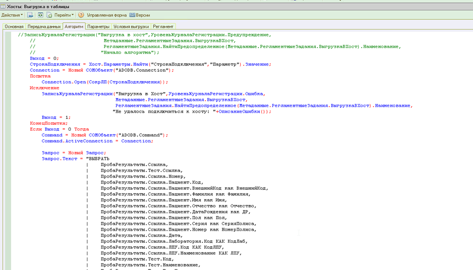

## ЦЕЛЬ И СРЕДСТВА проекта 

&emsp;Цель работы –  повышение эффективности деятельности организации за счет создания и внедрения модуля интеграции с внешними системами для автоматизированной информационно-аналитической системы ЛИС АЛИСА. 

&emsp;Средство достижения цели - проектирование модуля интеграции информационной системы для автоматизированной информационно-аналитической системы ЛИС АЛИСА в ЗАО «Фирма Гален».  

## СПИСОК ТРЕБОВАНИЙ К РАЗРАБАТЫВАЕМОМУ МОДУЛЮ ИНТЕГРАЦИИ

1) интеграция модуля в основе платформы 1С: Предприятие;   
2) источники поступления своевременных, а также относительно-стабильных данных;
2) этапы решения задания, очередность и временное расписание их исполнения;.
4) краткая оценка концепции ведения файлов в модуле (список файлов с относительно-стабильными и своевременными данными, цикличность обновления, а также условия защиты целостности и секретности).

## ОБЩАЯ СХЕМА МОДЕЛИ ПРОЦЕССА ВЗАИМОДЕЙСТВИЯ «ВРАЧ-ПАЦИЕНТ»

## СХЕМА МОДЕЛИ ВЗАИМОДЕЙСТВИЯ 
«ВРАЧ-ПАЦИЕНТ» – «КАК ЕСТЬ»

## СХЕМА МОДЕЛИ ВЗАИМОДЕЙСТВИЯ «ВРАЧ-ПАЦИЕНТ» – «КАК ДОЛЖНО БЫТЬ»

## ЛОГИЧЕСКАЯ МОДЕЛЬ

## ФИЗИЧЕСКАЯ МОДЕЛЬ

## ВЫБОР ПО ДЛЯ ВЫПОЛНЕНИЯ ЗАДАЧ

## Программная реализация пользовательского интерфейса системы 

&emsp;Для реализации требований к создаваемому модулю интеграции данных, было принято решение реализовать в ЛИС АЛИСА хост, который будет выполнять передачу данных напрямую в базу данных на сервере.

&emsp;Данный алгоритм написан на языке 1С

&emsp;Далее создадим сервер с базой.

&emsp;Заключительном этапом разработки является создание Веб- приложения , для этого используем:

1.	Flask – Фреймворк для создания веб-приложений на языке Python.
2.	Flask_sqlalchemy – набор SQL-инструментов для Python и инструмент объектно-реляционного отображения (ORM).
3.	Flask_login – для обработки пользовательских сеансов после аутентификации.
4.	Werkzeug.security – это библиотека python, которая содержит множество инструментов разработки и отладки для реализации приложений web application gateway interface (WSGI).

&emsp;Спроектируем пользовательский интерфейс. Для проектирования HTML страниц будем использовать Bootstrap. 

&emsp;Для входа на сайт, пользователь должен будет пройти регистрацию. Создадим форму регистрации и авторизации, где пользователь должен будет ввести свои данные и пароль.

&emsp;Создадим базовый шаблон с навигационной панелью, где будет возможность переходить по разделам сайта и видеть свой результат исследования 

&emsp;При успешной авторизации, или по переходе по кнопки «Мои исследования» пользователь видит все результаты своих тестов.

&emsp;Пользователь может нажать на кнопку подробнее у интересующего его исследования. По этой ссылке откроется полная информация о проделанном исследовании.

&emsp;При нажатии на кнопку мой аккаунт, пользователь может настроить свои данные или выйти из системы. 

&emsp;При выборе настроек аккаунта, пользователь сможет посмотреть свои учетные данные.

&emsp;При выборе пункта « Выйти из аккаунта», то произойдет выход из профиля. Если пользователь не авторизован, то он не сможет пользоваться функционалом сайта, а при переходе по ссылкам , его будет переадресовывать на страницу авторизации.
