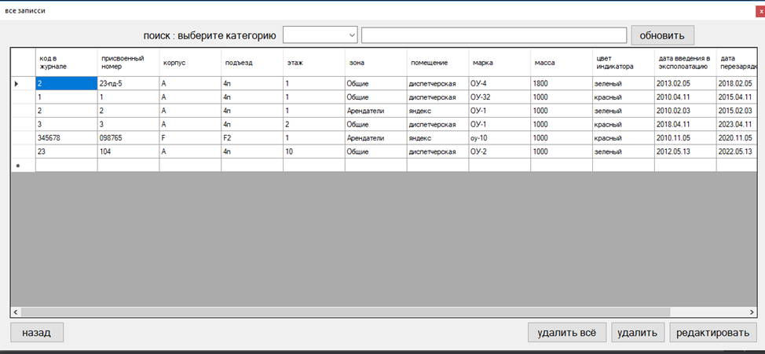
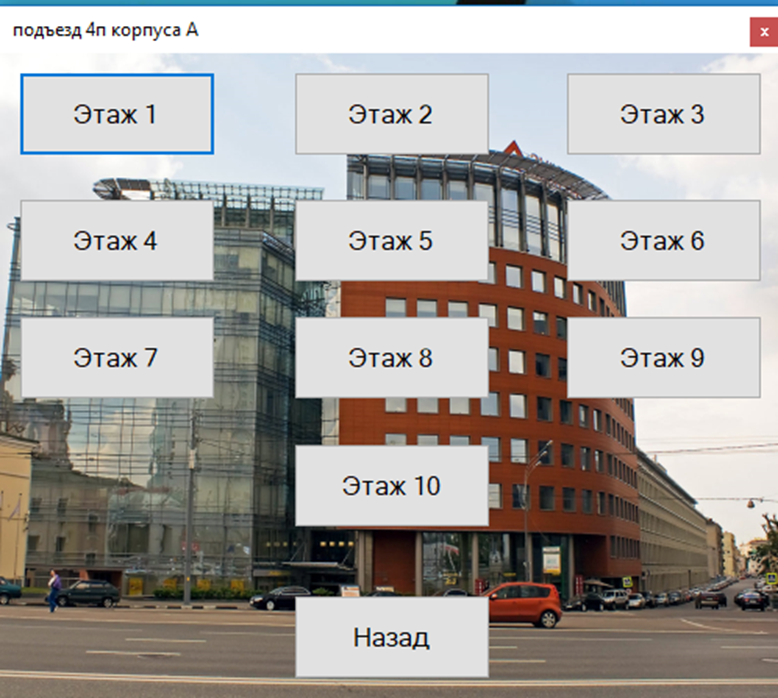

&emsp;Актуальность данного проекта заключается в том, что информация об огнетушителях хранится в бумажных носителях и необходимо перевести в цифровой вид всё данные об огнетушителях, также им приходится полагаться на память в тех случаях, когда необходимо уточнить, когда следующая перезарядка или взвешивание огнетушителя, из за этих нюансов есть риск упустить важные моменты и забыть о каком ни будь огнетушители, тем самым будет огромный риск и опасность в возникновении пожара.   Разрабатываемый программный продукт позволит значительно облегчить труд работников, повысить качество их работы, и снизить количество ошибок.

## Проектирование концептуальной модели БД

&emsp;На диаграмме прецедентов представлены автоматизируемые бизнес-процессы компании и их исполнители. Любые системы, в том числе и программные, используются с учетом того, что в процессе своей работы они будут использоваться людьми и взаимодействовать с другими системами. Диаграмма прецедентов показывает, что именно выполняется в системе

Рисунок 1 – Диаграмма прецедентов

&emsp;Далее разрабатываем концептуальную модель базы данных. Спроектируем концептуальную модель БД. Пользуясь технологией ER-моделирования, выделим сущности и связи между ними. На рисунке 2 показана концептуальная модель предметной области ПО в нотации ER MS Visio 2007. Стрелка указывает на главную таблицу в связи «Один ко многим» это сторона «Один». Символы PK (Primary Key) используются для обозначения атрибутов сущности, которые являются главными ключами. Внешние ключи при этом не обозначаются. Далее переходим к составлению таблицы сущностей концептуальной модели.

Рисунок 2 – Концептуальная модель БД.

Рисунок 3 – Логическая модель БД.

Рисунок 4 - Физическая модель ИС. 

## Проектирование интерфейса пользователя

&emsp;Когда модель базы данных разработана, т.е. состав сущностей, связи между ними, поля – характеристики, определенны первичные и внешние ключи, необходимо продумать и создать графический интерфейс пользователя.
Графический интерфейс пользователя являться важнейшей частью любого программного продукта. От интерфейса зависит скорость обучения пользователя работе с программой и качество выполняемой работы.

Рисунок 5 – диаграмма активности ПО

## Интерфейса программного продукта

&emsp;При запуске программы открывается главное меню программы (см. Рисунок 6).
 
Рисунок 6 – главное меню

&emsp;На данной форме изображен план здания для удобства навигации, а также кнопки для добавления новых огнетушителей, просмотра всех записей и ближайших замен. На верхней панели есть раздел помощи и информации о программном обеспечении.
При нажатии на кнопку добавить, появиться окно добавлении новых огнетушителей (см. Рисунок 7).
 

Рисунок 7 – добавление нового огнетушителя

&emsp;Для добавления нового огнетушителя необходимо ввести следующую информацию: заводской номер огнетушителя. Далее необходимо ввести информацию его местоположения: присвоенный номер, корпус, подъезд, этаж, зона и помещение, в котором находиться огнетушитель. Потом вводим информацию о его характеристиках: тип, марку, масса, цвет индикатора, время следующей перезарядки и дату введения в эксплуатацию.

&emsp;При открытии формы всех записей, будет показана таблица со всеми записями (см. Рисунок 8).
 

Рисунок 8 – все записи

&emsp; На форме есть кнопка удаления всех записей из базы данных, а также   удаление выбранного элемента. При нажатии на редактирование будет открыто окно, в котором можно изменить выбранный огнетушитель. Еще на форме присутствует строка поиска.
При выборе формы предупреждения о заменах огнетушителя, откроется меню с двумя таблицами (см. Рисунок 9).
 

Рисунок 9 – замены огнетушителя

&emsp;В первой таблице отображаются ближайшее взвешивания огнетушителя, которое проводиться раз в год. 
Во второй таблице отображаются ближайшие перезарядки огнетушителей, которое проводиться раз в 5 или 10 лет.
При перезарядке или взвешивании есть кнопки подтверждения, при нажатии на которых начнётся новый цикл. А также необходимо было реализовать печать базы данных.
Для этих целей было написано две функции:
1)	Функция, которая отдает документ на печать 

2)	Функция создания документа, который необходимо распечатать

&emsp;Для удобства поиска необходимого огнетушителя, была реализована навигация по зданию.

&emsp;При выборе корпуса А откроется форма с выбором этажа (см. Рисунок 10).
 
Рисунок 10 – выбор этажа

&emsp;Далее пользователю необходимо выбрать этаж. После выбора надо выбрать зону обслуживания: общая зона — это зона которую контролируют работники компании «MD» а зона арендаторов эта зона, которою контролируют компании (см. Рисунок 11).
 
Рисунок 11 – выбор зоны

&emsp;После выбора откроется форма на которой будет таблица в которой будет написано какие огнетушители находятся в данном месте (см.Рисунок 12)
 
Рисунок 12 – огнетушители в общей зоне корпуса А, 10 этаж

## Защита информации
&emsp;В данном ПО предусмотрена защита от несанкционированного доступа путем авторизации пользователя через логин и пароль. Для этого используется отдельное окно при открытии Microsoft Access. Если пользователь ввел неправильные данные, система сообщит ему об этом.
 
Рисунок 13 – форма ввода пароля
При правильном введении логина и пароля, открывается база данных.
