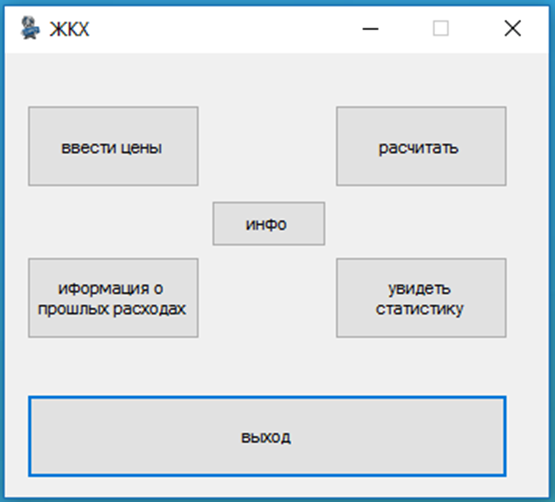
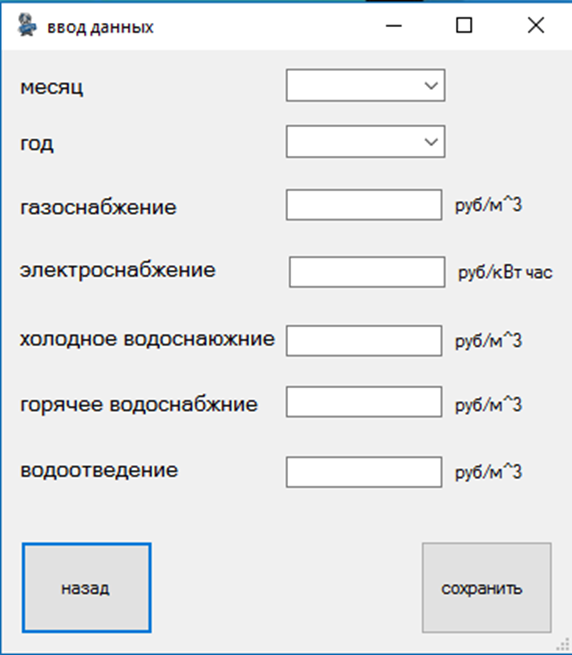
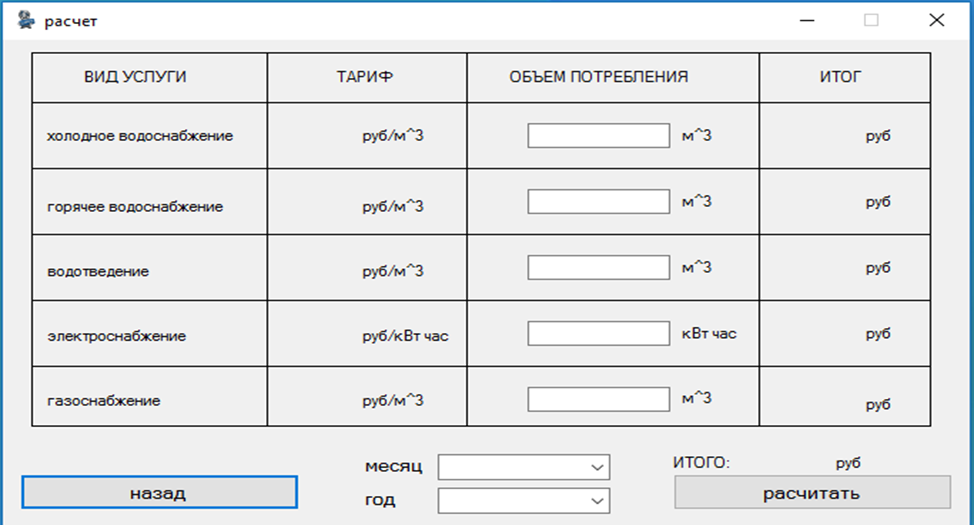
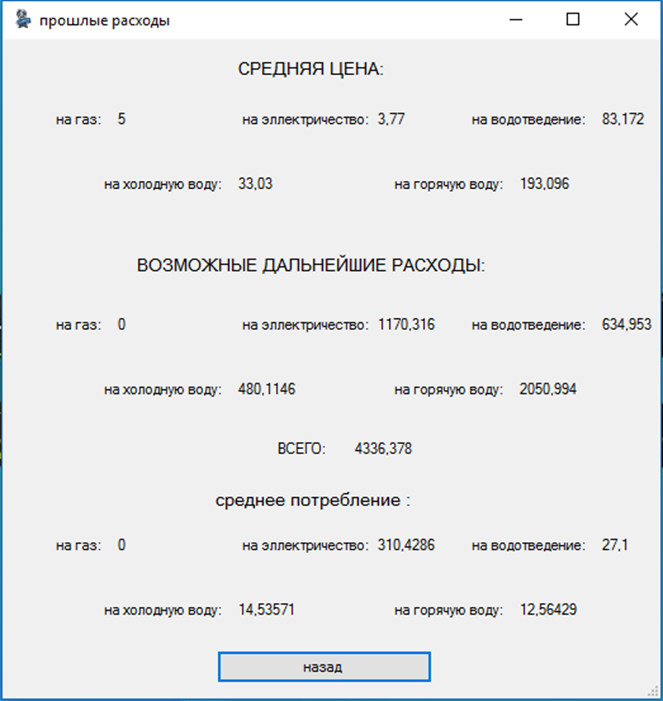
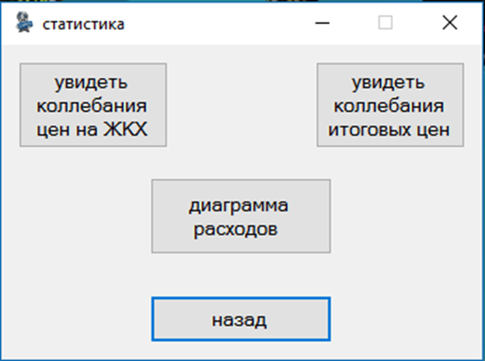
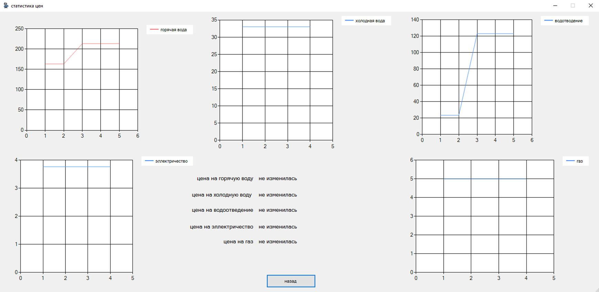
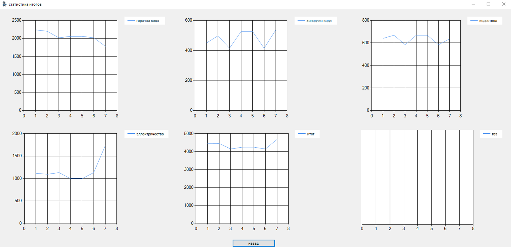
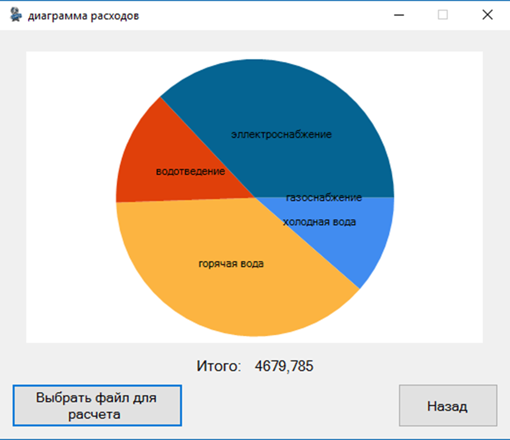

## Описание интерфейса 

При разработке данной программы необходимо создать удобный и понятный графический интерфейс для пользователя, который будет осуществлять взаимодействие между пользователем и кодом программы. Интерфейс должен быть понятен. Таким образом, чтобы пользователю не требовалось объяснять, как им пользоваться. 

    Поэтому мы создали очень удобный и понятный интерфейс, в котором все находится рядом и участие пользователя минимальное, так как за тебя все делает программа. 
    
---

## Главное меню

    Главное меню выглядит очень просто, что бы пользователь мог без труда в нем разобраться, и без подсказок найти нужный ему пункт 

Рисунок 1 – главное меню программы

Мы видим 6 кнопок:
1.	Вводе цен – при нажатии этого пункта, открывается форма в которой осуществляется ввод трафика.
2.	Расчёт – на этой форме, происходит ввод показаний счетчиков
3.	Инфо – тут информация о разработчиков и версии программы
4.	Информация о прошлых расходах – на этой форме происходит подсчет и вывод на экран возможные дальнейшие расходы.
5.	Увидеть статистику – на этой форме мы должны будет выбрать, какую статистику мы хотим увидеть.
6.	Выход, эта кнопка закрывает программное обеспечение.

---
## Ввод трафика (цен)

	В этом окне пользователь вводит цены на ЖКХ за месяц.

Рисунок 2 – ввод трафика

Исходя из введённых данных будет высчитываться смета за месяц, а из этой сметы будут строиться графики, диаграммы и высчитываться статистка и дальнейшие расходы. А также при следующем запуске программы, введенные данные буду сохраняться, что бы их повторно не вводить, это обеспечивает такое свойство программы как параметры. Параметры приложения позволяют динамически сохранять и извлекать параметры свойств и другие данные для приложения. Например, приложение может сохранять пользовательские параметры цветов и извлекать их при следующем запуске. В данном случае, они позволяют сохранять данные из textbox.Text. При нажатии кнопки сохранить, данные сохраняться в файл, в дальнейшем мы будет считывать их оттуда. 

---
## Расчет коммунальных услуг

    Одной из самых важных частей программы является расчет. Для удобства, ввода данных это сделано в виде таблицы.

Рисунок 3 – Расчет потребления

А также есть два combobox в которых надо выбрать месяц и год, это создано для того, чтобы в дальнейшем при просмотре диаграммы, мы выбирали нужный нам файл. Благодаря параметрам, данные введенные в форме ввода трафика, автоматически появляться в колонке тариф, чтобы пользователь при вводе показания счетчиков мог мысленно понимать расходы. При нажатии кнопки рассчитать, введённые данные считаться и выводиться итоговая цена в столбец итоги, а также сохраняются в файл для дальнейших подсчетов. После завершения подсчетов и сохранения в файл, будет выведено окно, в котором будет написано: «данные посчитаны и сохранены в файл». 

---
## Информация о прошлых расходах 

    На данной форме показана информация о возможных дальнейших расходах 

Рисунок 4 – прошлые расходы 

Данная форма делиться на 3 раздела 
1.	Средняя цена – выводит среднюю цену на элементы ЖХК (газ, электричество и т.д.).
2.	Возможные дальнейшие расходы – показывает среднее от всех итоговых данных, чем из больше, тем точнее аналитика.
3.	Среднее потребление – тоже самое что и дальнейшие расходы, только вместо итоговых данных, считаться введённые данные с счетчиков.
	Она использует файлы которое мы ранее создавали. Считывает из них данные, подсчитывает и выводит на экран. Что бы упросить задачу для пользователя, на этой форме нет кнопок, а прогрузка всех данных происходит в загрузке формы. 

---
## Вывод статистики

    Вот мы пришли к самому основному элементу программы, которою ее отличает от остальных приложений подсчета коммунальных услуг. Это вывод графиков и диаграмм. Во время написания мы пришли к выводу разделить это на 3 подпункта 

Рисунок 5 – статистика

---
## Колебания цен на ЖКХ

    На данной форме, нарисованы графики, изображающие колебания цен (трафика) на ЖХК, тем самым графически показывая, как изменялись цены за весь период пока мы ведем статистику. 

Рисунок 6 – Колебания тарифных цен на ЖКХ

---

## Колебания итоговых цен 

    Данная форма представляет из себя форму с графиками в которых изображены колебания итоговых цен, которые получились после подсчета коммунальных услуг. 

Рисунок 7 – Изменения итоговых цен 

---

## Диаграмма расходов 

    Это одна из самых интересных форм. В ней пользователь будет выбирать файл который ему нужен, для этого был использован open file dialog. В Open File Dialog мы должны будем выбрать файл с расширением .ExC, это сделано для того, чтобы нужные нам файлы фильтровались. И мы выбирали только те, в которых есть необходимые нам данные. 

Рисунок 7 – Диаграмма расходов 