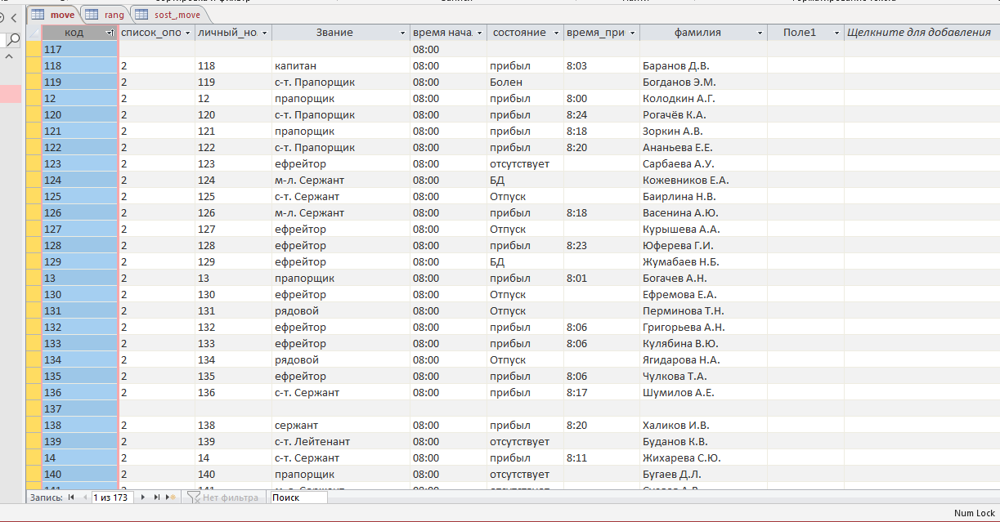
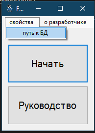
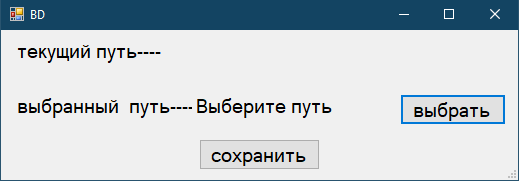
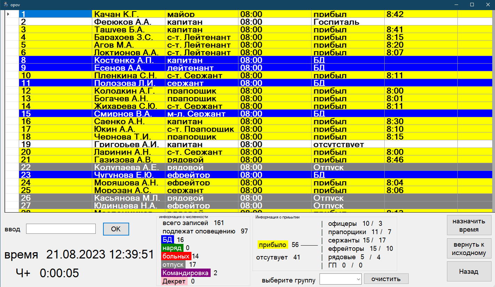

## Данная программа создавалась в целях учета сотрудников котрые пришли на объект

### Создается база данных в Acсess, в оболочке 

### В начале работы необходимо выбрать данную таблицу 

### При нажатии на кнопку начать, запуститься тамер и откроектся окно в котором польователи будут вводить свой личный номер и подтверждать прибытие

