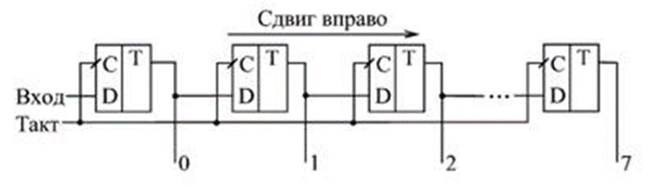

## АННОТАЦИЯ

Ввод информации в 20-х разрядный реверсивный регистр в последовательном коде, а также в параллельном коде через 4-х контактный разъем.
1.	Разработать проект печатной платы ФУ, функциональную схему заданного функционального узла. Разработать блок-схему выполнения операций. 
2.	Построить временную диаграмму работы функционального узла. 

 

## Общая методика выполнения  работы

Регистры сдвига
Направление сдвига отражают внутреннюю структуру регистров сдвига и перезапись сигналов последовательно по цепочке триггеров. При этом триггеры, вполне естественно, нумеруются слева направо, например, от 0 до 7 (или от 1 до 8) для 8-разрядных регистров. В результате сдвиг информации регистром вправо представляет собой сдвиг в сторону разрядов, имеющих большие номера, а сдвиг информации регистром влево — это сдвиг в сторону разрядов, имеющих меньшие номера.
Однако, как известно, в любом двоичном числе слева расположены старшие разряды, а справа - младшие разряды. Поэтому сдвиг двоичного числа вправо будет сдвигом в сторону младших разрядов, а сдвиг влево - сдвигом в сторону старших разрядов. О такой особенности необходимо помнить разработчику цифрового прибора.

Регистры сдвига могут выполнять функции хранения и преобразования информации.
Они могут быть использованы для построения умножителей и делителей чисел двоичной системы счисления, т.к. сдвиг двоичного числа влево на один разряд соответствует умножению его на два, а сдвиг вправо - делению на два.

## Методика проектирования функциональной и логической схемы цифрового устройства.

### Блок-схема алгоритма работы функционального узла

### Структурная схема ФУ на съёмной плате

## Принцип работы

Для пояснения принципа работы, возьмем для примера Сдвигающий трехразрядный регистр 

Для построения сдвигающего регистра использованы D-триггеры D1, D2, D3. Каждый выход Q связан с D-входом следующего триггера.
Параллельная запись информации в триггеры осуществляется посредством асинхронных входов R, S при наличии разрешающего сигнала EI =1. Сигналы R, S формируются логическими элементами D4, D5, D6.
Коды D2, D1, D0 поступают на входы S в прямом виде, а на входы R в инверсном и, согласно таблице истинности RS-триггера, происходит запись значения этих логических сигналов.
Хранимая в сдвигающем регистре информация может быть считана на выходах Q2, Q1, Q0. Сдвиг данных в регистре происходит после подачи тактового сигнала C. Возможна запись последовательного кода с помощью входа D, а считывание с выхода Q2.
Параллельные операции считывания и записи в данной схеме не тактируемы.
Данные регистры сдвига могут применяться для обеспечения передачи информации из компьютера, работающего в параллельном коде, по линии связи в последовательном коде. В приемном устройстве осуществляется обратное преобразование (COM порт компьютера).

## Логическая схема в системе схемотехнического проектирования simulator.io

https://simulator.io/board/wabC0T9Kf3

## Временная диаграмма

