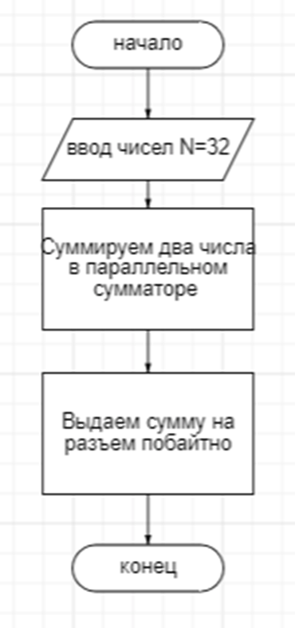
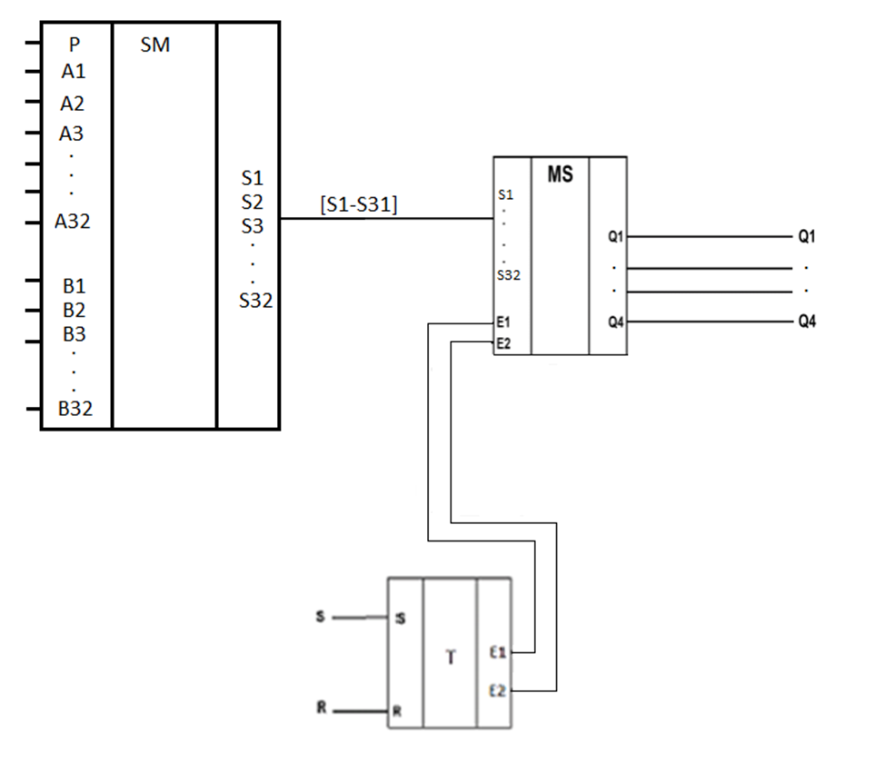
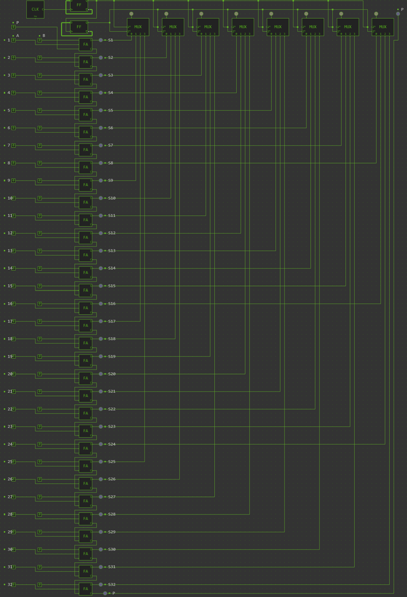
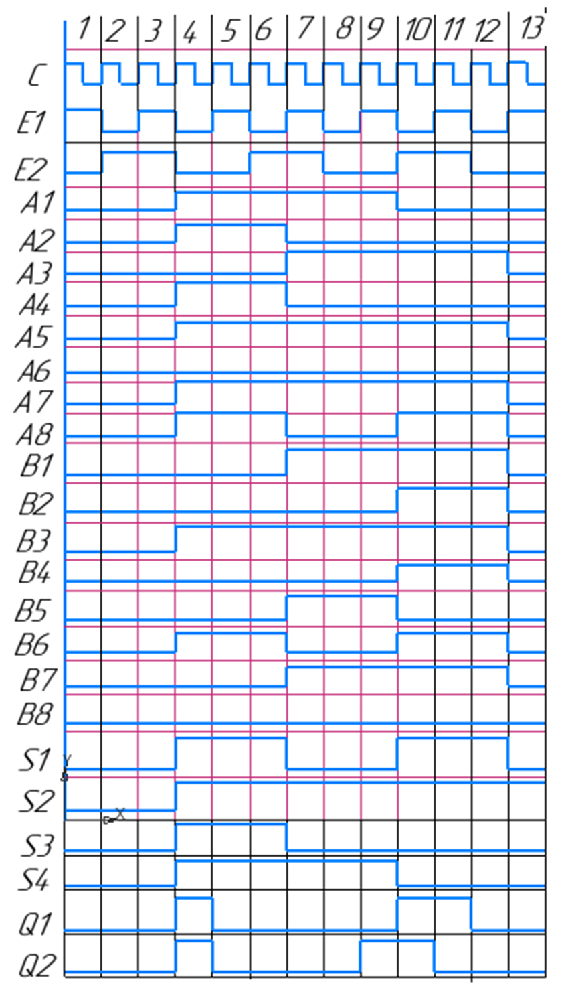

## АННОТАЦИЯ

Разработать двоичный сумматор параллельного действия (N=32). Сумму выдать на разъем побайтно.
1.	Разработать проект печатной платы ФУ, функциональную схему заданного функционального узла. Разработать блок-схему выполнения операций. 
2.	Построить временную диаграмму работы функционального узла. 
  

### Блок-схема алгоритма работы функционального узла

### Структурная схема ФУ на съёмной плате

## Логическая схема в системе схемотехнического проектирования simulator.io

http://simulator.io/board/WldCMadVW4/4 

## Временная диаграмма

