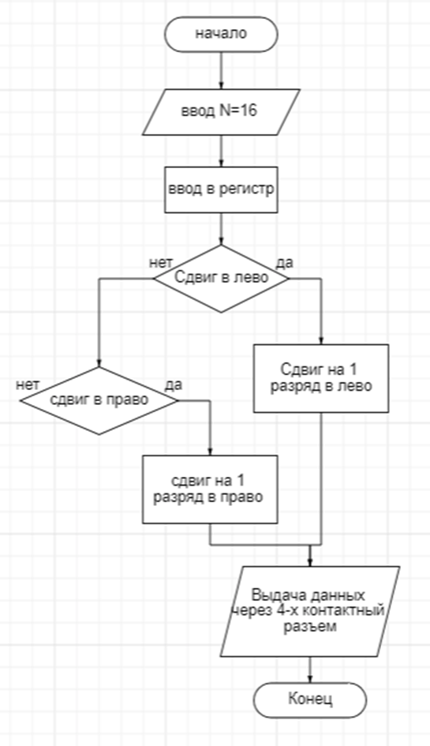
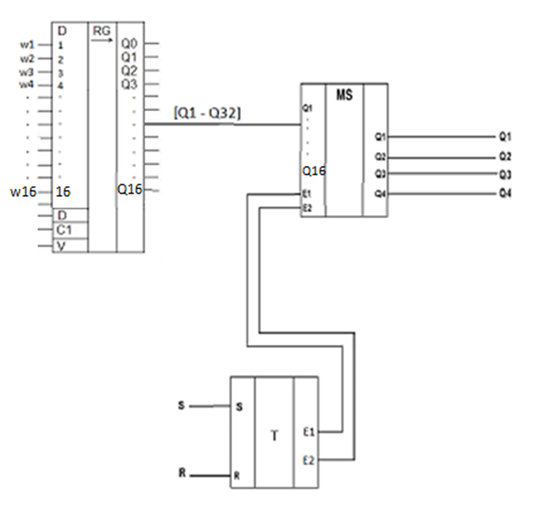
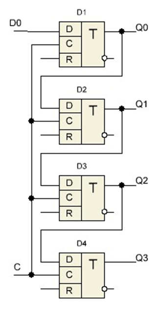
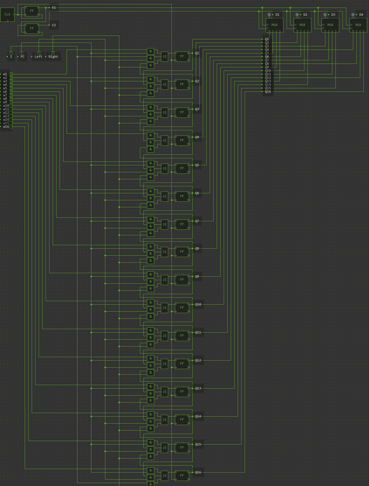
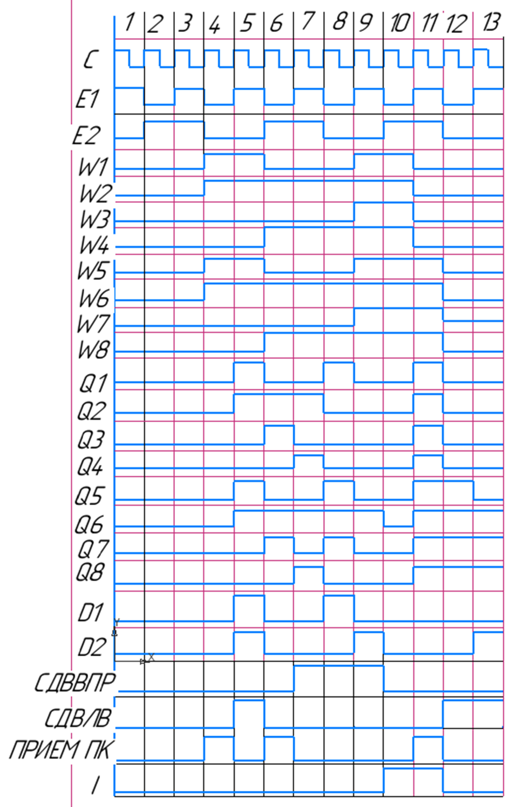

## АННОТАЦИЯ

Разработать реверсивный регистр сдвига, предусмотреть ввод информации в параллельном коде, N=16. Выдача данных через 4-х контактный разъем.
1.	Разработать проект печатной платы ФУ, функциональную схему заданного функционального узла. Разработать блок-схему выполнения операций. 
2.	Построить временную диаграмму работы функционального узла. 
 

## Общая методика выполнения  работы

Регистры сдвига
Последовательные (сдвигающие) регистры представляют собой цепочку триггеров, связанных цепями переноса.
В однотактных регистрах со сдвигом на один разряд вправо (рис. 1, а) слово сдвигается при поступлении синхронизирующего сигнала. При каждом импульсе сдвига происходит перезапись содержимого предыдущего триггера в последующий и запись очередного разряда в крайний левый триггер. В результате за четыре такта в регистр будет занесено четырехразрядное слово. Причем первый (по времени поступления) разряд будет занесен в крайний правый регистр.

## Методика проектирования функциональной и логической схемы цифрового устройства.

### Блок-схема алгоритма работы функционального узла

### Структурная схема ФУ на съёмной плате

## Принцип работы

Рассмотрим четырёхразрядный регистр сдвига, преобразующий последовательный двоичный код в параллельный. Применение последовательного кода оправдано тем, что по одной линии можно передавать огромные массивы информации. Таким примером может служить универсальная последовательная шина - USB порт любого устройства. Число триггеров в данном регистре может быть любым. Достаточно соединить прямой выход Q3 с D входом следующего триггера и так далее до достижения необходимой разрядности.

Регистр работает следующим образом. Первый информационный бит поступает на вход D0. Одновременно с этим битом приходит тактовый синхроимпульс на вход С. Входы С всех триггеров входящих в регистр, объединены между собой. С приходом первого тактового импульса уровень, находящийся на входе D0 записывается в первый триггер и с выхода Q0 приходит на вход следующего триггера, но записи во второй триггер не происходит, так как синхроимпульс уже закончился.
При поступлении следующего тактового импульса уровень, присутствующий на входе второго триггера запоминается в нём и поступает на вход третьего триггера. Одновременно следующий информационный бит запоминается в первом триггере. После прихода четвёртого тактового импульса в четырёх триггерах регистра будут записаны логические уровни, которые последовательно поступали на вход D0.

## Логическая схема в системе схемотехнического проектирования simulator.io

https://simulator.io/board/ATTPP8WnXQ/2

## Временная диаграмма

