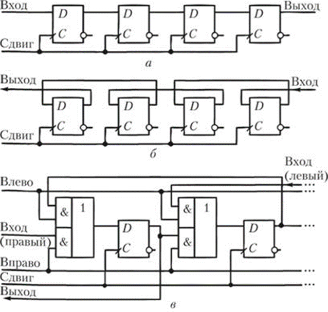
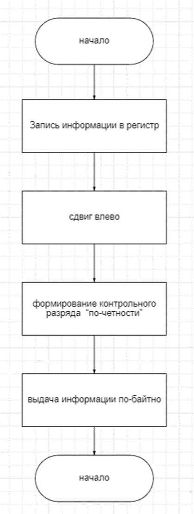
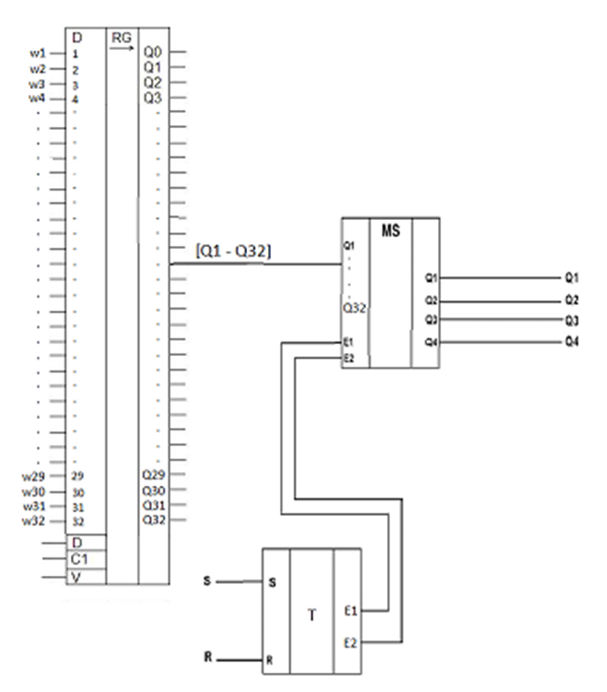
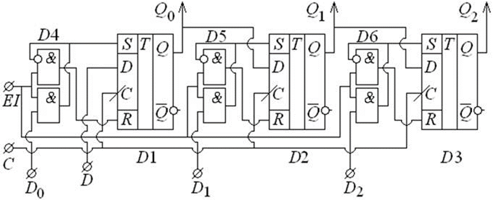
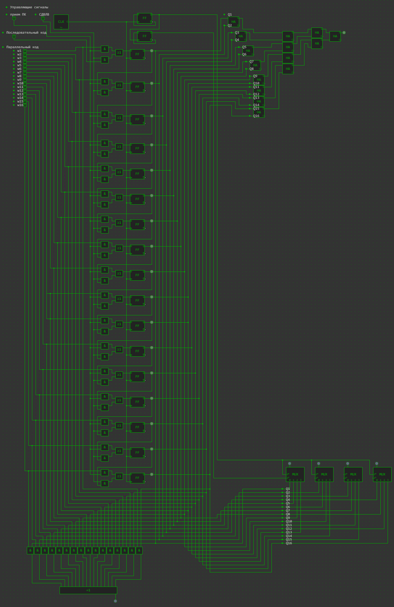
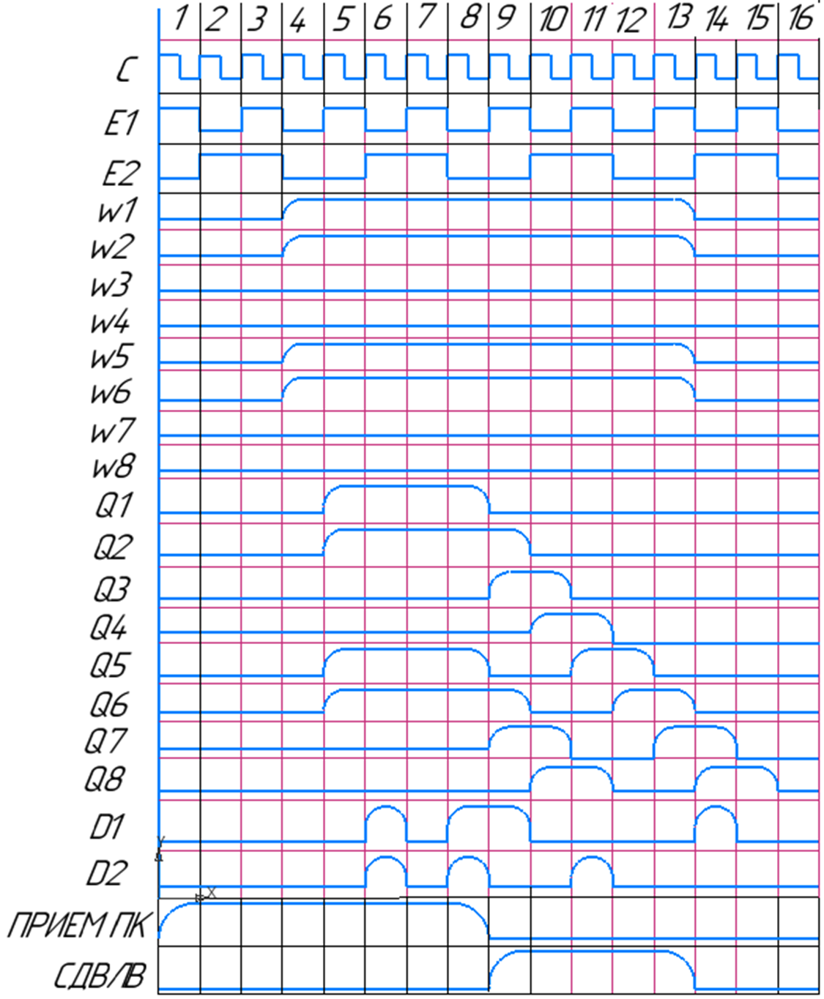

## АННОТАЦИЯ

Разработать регистр сдвига влево с параллельным приемом информации. Предусмотреть формирование контрольного разряда  “по-четности” при выдаче информации по-байтно,  N =32.
1.	Разработать проект печатной платы ФУ, функциональную схему заданного функционального узла. Разработать  блок-схему выполнения операций. 
2.	Построить временную диаграмму работы функционального узла. 

## Общая методика выполнения  работы

Регистры сдвига
Последовательные (сдвигающие) регистры представляют собой цепочку триггеров, связанных цепями переноса.
В однотактных регистрах со сдвигом на один разряд вправо (рис. 1, а) слово сдвигается при поступлении синхронизирующего сигнала. При каждом импульсе сдвига происходит перезапись содержимого предыдущего триггера в последующий и запись очередного разряда в крайний левый триггер. В результате за четыре такта в регистр будет занесено четырехразрядное слово. Причем первый (по времени поступления) разряд будет занесен в крайний правый регистр.

## Методика проектирования функциональной и логической схемы цифрового устройства.

### Блок-схема алгоритма работы функционального узла

### Структурная схема ФУ на съёмной плате

## Принцип работы

Для пояснения принципа работы, возьмем для примера Сдвигающий трехразрядный регистр

Для построения сдвигающего регистра использованы D-триггеры D1, D2, D3. Каждый выход Q связан с D-входом следующего триггера.
Параллельная запись информации в триггеры осуществляется посредством асинхронных входов R, S при наличии разрешающего сигнала EI =1. Сигналы R, S формируются логическими элементами D4, D5, D6.
Коды D2, D1, D0 поступают на входы S в прямом виде, а на входы R в инверсном и, согласно таблице истинности RS-триггера, происходит запись значения этих логических сигналов.
Хранимая в сдвигающем регистре информация может быть считана на выходах Q2, Q1, Q0. Сдвиг данных в регистре происходит после подачи тактового сигнала C. Возможна запись последовательного кода с помощью входа D, а считывание с выхода Q2.
Параллельные операции считывания и записи в данной схеме не тактируемы.
Данные регистры сдвига могут применяться для обеспечения передачи информации из компьютера, работающего в параллельном коде, по линии связи в последовательном коде. В приемном устройстве осуществляется обратное преобразование (COM порт компьютера).

## Логическая схема в системе схемотехнического проектирования simulator.io

http://simulator.io/board/bMgZYMrD6z/9

## Временная диаграмма

