## ОПИСАНИЕ РАБОТЫ ПРОГРАММЫ  

&emsp;При запуске программы появиться главное меню, в котором есть 3 кнопки: - расшифровать, зашифровать и информация. (См. Рисунок 1).

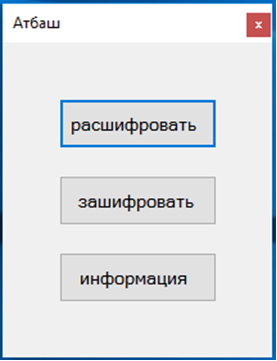

Рисунок 1-Главное меню.

&emsp;При нажатии на кнопку информация, появиться форма, на которой будет написана информация о программе,  а так же небольшая статья о методе шифрования Атбаш. 

&emsp;Кнопка зашифровать, перевод нас на форму где мы должны ввести название нашего файла и выбрать его тип. Всего 4 типа: 

1) Латынь (см. Рисунок 2);
2) Английский (см. Рисунок 3);
3) Цифры (см. Рисунок 4);
4) Русский.

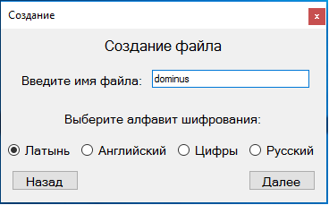

Рисунок 2 - Создание файла на латыни.

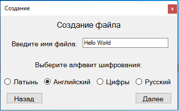

Рисунок 3 - Создание файла на английском.

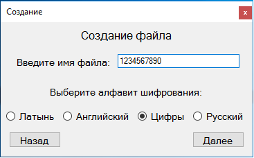

Рисунок 4 - Создание файла с цифрами.

&emsp;В зависимости, какой алфавит мы выберем, будет использоваться та или иная форма со своими правилами и синтаксисом.
&emsp;После того как пользователь выберет алфавит и введет название файла, должен нажать кнопку далее, после ее нажатия откроется форма заполнения файла в которой надо вести шифруемый текст. На рисунках 5-7 изображено заполнения файла, так же во время ввода, шифруемый текст появляется снизу, чтобы пользователь представлял, что у него получается.

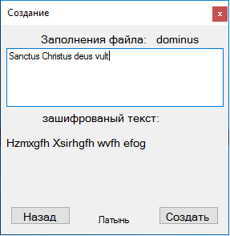

Рисунок 5 – заполнение файла на латыни.

Рисунок 6 – заполнения файла на английском.

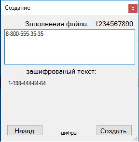

Рисунок 7 – заполнение файла цифрами.

&emsp;Отличие латыни от английского языка в том, что в первом случает буквы “W”  не существует и если пользователь попробует ее ввести, то программа выдаст ошибку и подскажет, что данной буквы нет в алфавите
 (см. Рисунок 8).

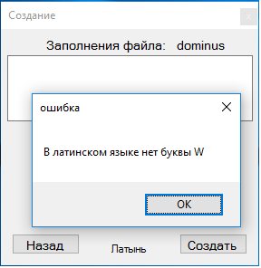

Рисунок 8 – Ошибка с буквой W.

&emsp;После того как пользователь создал зашифрованный файл, он может его расшифровать, выбрав в начальном меню пункт расшифровать.
&emsp;При нажатии на кнопку откроется диалоговое окно, в котором пользователю будет предложено выбрать файл для расшифровки
(см. Рисунок 9).

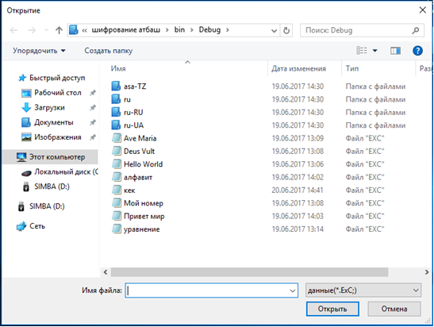

Рисунок 9 – выбор файла для расшифровки.

&emsp;После выбора файла, откроется форма, на которой будет показан зашифрованный текст из файла и его расшифрованная копия 
(см. Рисунок 11-12) .

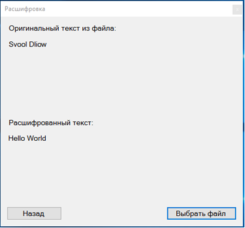

Рисунок 10 - расшифрованный файл на английском.

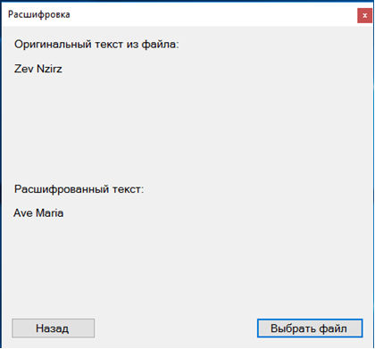

Рисунок 11 - расшифрованный файл на латыни.

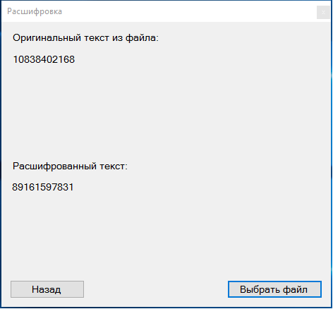

Рисунок 12 - расшифрованный файл с цифрами.

## АЛГОРИТМ 

&emsp;Алгоритм программы, весьма прост, и сам метод шифрования можно разделить на 4 пункта:
1.	Ввод символа в Textbox;
2.	Присваиваем переменной, значение введенного символа;
3.	Методом switch case, меняем символ на противоположный;
4.	Записываем получившийся символ в Label.
&emsp;Таким образом, пользователь во время вводы данных видит получившийся результат. Потом происходит сохранение данных из Label  в файл.
